# PostgreSQL Schema Entity-Relationship Diagram

## Visual ER Diagram

```mermaid
erDiagram
    schools ||--o{ users : "has"
    schools ||--o{ students : "has"
    schools ||--o{ teachers : "has"
    schools ||--o{ parents : "has"
    schools ||--o{ sections : "has"
    schools ||--o{ learning_areas : "has"
    schools ||--o{ grades : "has"
    schools ||--o{ core_values : "has"
    schools ||--o{ core_value_grades : "has"
    schools ||--o{ class_schedules : "has"
    schools ||--o{ attendance_records : "has"
    schools ||--o{ assignments : "has"
    
    users ||--o| students : "portal login"
    users ||--o| teachers : "belongs to"
    users ||--o| parents : "portal login"
    
    sections ||--o{ students : "enrolled in"
    sections |o--|| teachers : "advised by"
    sections ||--o{ class_schedules : "has schedule"
    sections ||--o{ assignments : "has assignments"
    sections ||--o{ attendance_records : "has attendance"
    
    students ||--o{ grades : "receives"
    students ||--o{ core_value_grades : "evaluated"
    students ||--o{ attendance_records : "attended"
    students }o--o{ parents : "child of"
    
    teachers ||--o{ class_schedules : "teaches"
    teachers ||--o{ assignments : "creates"
    teachers ||--o{ grades : "grades"
    teachers ||--o{ core_value_grades : "evaluates"
    teachers ||--o{ attendance_records : "records"
    
    learning_areas ||--o{ grades : "subject of"
    learning_areas ||--o{ class_schedules : "taught in"
    learning_areas ||--o{ assignments : "subject of"
    
    core_values ||--o{ core_value_grades : "measured by"
    
    schools {
        uuid id PK
        varchar name
        varchar school_id_number UK
        varchar division
        varchar region
        text address
        varchar contact_email
        varchar contact_phone
        varchar principal_name
        varchar current_school_year
        jsonb settings
        timestamptz created_at
        timestamptz updated_at
        timestamptz deleted_at
    }
    
    users {
        uuid id PK
        uuid school_id FK
        varchar firebase_uid UK
        varchar email
        user_role role "ENUM: admin, teacher, student, parent"
        varchar name
        text avatar_url
        boolean is_active
        timestamptz created_at
        timestamptz updated_at
        timestamptz deleted_at
    }
    
    students {
        uuid id PK
        uuid school_id FK
        uuid user_id FK "optional"
        varchar lrn UK "12-digit DepEd LRN"
        varchar name
        varchar first_name
        varchar middle_name
        varchar last_name
        varchar suffix
        gender_type gender "ENUM: Male, Female"
        date date_of_birth
        varchar place_of_birth
        uuid section_id FK
        integer grade_level "1-12"
        varchar enrollment_status
        text address
        varchar contact_number
        varchar email
        varchar religion
        boolean indigenous_people
        timestamptz created_at
        timestamptz updated_at
        timestamptz deleted_at
    }
    
    teachers {
        uuid id PK
        uuid school_id FK
        uuid user_id FK
        varchar name
        varchar employee_number
        varchar specialization
        varchar department
        timestamptz created_at
        timestamptz updated_at
        timestamptz deleted_at
    }
    
    parents {
        uuid id PK
        uuid school_id FK
        uuid user_id FK "optional"
        varchar name
        varchar relationship "Mother, Father, Guardian"
        varchar occupation
        varchar contact_number
        varchar email
        text address
        timestamptz created_at
        timestamptz updated_at
        timestamptz deleted_at
    }
    
    parent_students {
        uuid id PK
        uuid parent_id FK
        uuid student_id FK
        varchar relationship
        boolean is_primary_contact
        timestamptz created_at
    }
    
    sections {
        uuid id PK
        uuid school_id FK
        varchar name "e.g., St. Peter, Sampaguita"
        integer grade_level "1-12"
        varchar school_year "e.g., 2024-2025"
        uuid adviser_id FK
        varchar room_number
        integer capacity
        timestamptz created_at
        timestamptz updated_at
        timestamptz deleted_at
    }
    
    learning_areas {
        uuid id PK
        uuid school_id FK
        varchar code "MTB, FIL, ENG, MATH, etc."
        varchar name
        text description
        integer_array grade_levels "e.g., {1,2,3} for MTB"
        boolean is_composite "true for MAPEH"
        varchar_array components "e.g., {Music, Arts, PE, Health}"
        integer display_order
        boolean is_active
        timestamptz created_at
        timestamptz updated_at
        timestamptz deleted_at
    }
    
    grades {
        uuid id PK
        uuid school_id FK
        uuid student_id FK
        uuid learning_area_id FK
        varchar school_year
        numeric q1 "60-100 or NULL"
        numeric q2 "60-100 or NULL"
        numeric q3 "60-100 or NULL"
        numeric q4 "60-100 or NULL"
        jsonb composite_grades "MAPEH: {q1: {Music:85, Arts:90, ...}}"
        numeric final_grade "auto-calculated"
        varchar remarks "auto-set: Passed/Failed"
        uuid graded_by FK
        timestamptz graded_at
        timestamptz created_at
        timestamptz updated_at
        timestamptz deleted_at
    }
    
    core_values {
        uuid id PK
        uuid school_id FK
        varchar code "MAKA_DIYOS, MAKATAO, etc."
        varchar name
        text description
        integer display_order
        timestamptz created_at
        timestamptz updated_at
    }
    
    core_value_grades {
        uuid id PK
        uuid school_id FK
        uuid student_id FK
        uuid core_value_id FK
        varchar school_year
        core_value_rating q1 "ENUM: AO, SO, RO, NO"
        core_value_rating q2
        core_value_rating q3
        core_value_rating q4
        uuid graded_by FK
        timestamptz created_at
        timestamptz updated_at
        timestamptz deleted_at
    }
    
    class_schedules {
        uuid id PK
        uuid school_id FK
        uuid section_id FK
        uuid learning_area_id FK
        uuid teacher_id FK
        day_of_week day_of_week "ENUM: Monday-Sunday"
        time start_time
        time end_time
        varchar room
        timestamptz created_at
        timestamptz updated_at
        timestamptz deleted_at
    }
    
    attendance_records {
        uuid id PK
        uuid school_id FK
        uuid student_id FK
        uuid section_id FK
        date date
        attendance_status status "ENUM: Present, Absent, Late, Excused"
        text remarks
        uuid recorded_by FK
        timestamptz created_at
        timestamptz updated_at
    }
    
    assignments {
        uuid id PK
        uuid school_id FK
        uuid section_id FK
        uuid learning_area_id FK
        uuid teacher_id FK
        varchar title
        text description
        timestamptz due_date
        numeric max_score
        timestamptz created_at
        timestamptz updated_at
        timestamptz deleted_at
    }
```



---

## Table Relationship Summary

### One-to-Many Relationships

| Parent Table | Child Table | Relationship | Delete Rule |
|--------------|-------------|--------------|-------------|
| `schools` | `users` | 1 school has many users | CASCADE |
| `schools` | `students` | 1 school has many students | CASCADE |
| `schools` | `teachers` | 1 school has many teachers | CASCADE |
| `schools` | `sections` | 1 school has many sections | CASCADE |
| `schools` | `learning_areas` | 1 school has many learning areas | CASCADE |
| `schools` | `grades` | 1 school has many grades | CASCADE |
| `users` | `teachers` | 1 user can be 1 teacher | CASCADE |
| `sections` | `students` | 1 section has many students | SET NULL |
| `sections` | `class_schedules` | 1 section has many schedules | CASCADE |
| `teachers` | `sections` | 1 teacher advises many sections | SET NULL |
| `teachers` | `class_schedules` | 1 teacher has many schedules | CASCADE |
| `teachers` | `grades` | 1 teacher grades many students | SET NULL |
| `students` | `grades` | 1 student has many grades | CASCADE |
| `students` | `attendance_records` | 1 student has many records | CASCADE |
| `learning_areas` | `grades` | 1 learning area has many grades | RESTRICT |
| `learning_areas` | `class_schedules` | 1 learning area has many schedules | CASCADE |
| `core_values` | `core_value_grades` | 1 core value has many grades | CASCADE |

### Many-to-Many Relationships

| Table 1 | Table 2 | Junction Table | Use Case |
|---------|---------|----------------|----------|
| `parents` | `students` | `parent_students` | One parent can have multiple children, one child can have multiple parents/guardians |

---

## Key Indexes

### Performance Indexes

```sql
-- Multi-column indexes for common queries
CREATE INDEX idx_grades_student_year ON grades(student_id, school_year);
CREATE INDEX idx_grades_section_lookup ON grades(student_id, learning_area_id, school_year);
CREATE INDEX idx_students_section_grade ON students(section_id, grade_level);
CREATE INDEX idx_attendance_student_date ON attendance_records(student_id, date DESC);

-- GIN indexes for array searches
CREATE INDEX idx_learning_areas_grade_levels ON learning_areas USING GIN(grade_levels);

-- JSONB indexes for MAPEH composite grades
CREATE INDEX idx_grades_composite ON grades USING GIN(composite_grades);

-- Partial indexes for active records only
CREATE INDEX idx_students_active ON students(school_id, section_id) WHERE deleted_at IS NULL;
CREATE INDEX idx_teachers_active ON teachers(school_id) WHERE deleted_at IS NULL;
```

---

## Data Integrity Constraints

### Unique Constraints

```sql
-- Business logic uniqueness
ALTER TABLE students ADD CONSTRAINT uq_student_lrn UNIQUE (school_id, lrn);
ALTER TABLE sections ADD CONSTRAINT uq_section_per_year UNIQUE (school_id, grade_level, name, school_year);
ALTER TABLE grades ADD CONSTRAINT uq_grade_per_student_subject UNIQUE (student_id, learning_area_id, school_year);
ALTER TABLE core_value_grades ADD CONSTRAINT uq_cv_grade_per_student UNIQUE (student_id, core_value_id, school_year);
ALTER TABLE attendance_records ADD CONSTRAINT uq_attendance_per_day UNIQUE (student_id, date);
```

### Check Constraints

```sql
-- Grade level validation
ALTER TABLE students ADD CONSTRAINT chk_grade_level CHECK (grade_level BETWEEN 1 AND 12);
ALTER TABLE sections ADD CONSTRAINT chk_section_grade_level CHECK (grade_level BETWEEN 1 AND 12);

-- Grade range validation
ALTER TABLE grades ADD CONSTRAINT chk_q1_range CHECK (q1 IS NULL OR (q1 >= 60 AND q1 <= 100));
ALTER TABLE grades ADD CONSTRAINT chk_q2_range CHECK (q2 IS NULL OR (q2 >= 60 AND q2 <= 100));
ALTER TABLE grades ADD CONSTRAINT chk_q3_range CHECK (q3 IS NULL OR (q3 >= 60 AND q3 <= 100));
ALTER TABLE grades ADD CONSTRAINT chk_q4_range CHECK (q4 IS NULL OR (q4 >= 60 AND q4 <= 100));
ALTER TABLE grades ADD CONSTRAINT chk_final_grade_range CHECK (final_grade IS NULL OR (final_grade >= 60 AND final_grade <= 100));
```

---

## Database Triggers

### Auto-Update Triggers

```sql
-- Update `updated_at` timestamp automatically
CREATE OR REPLACE FUNCTION update_updated_at_column()
RETURNS TRIGGER AS $$
BEGIN
    NEW.updated_at = NOW();
    RETURN NEW;
END;
$$ LANGUAGE plpgsql;

-- Apply to all tables with updated_at
CREATE TRIGGER trigger_update_students_timestamp
    BEFORE UPDATE ON students
    FOR EACH ROW
    EXECUTE FUNCTION update_updated_at_column();

CREATE TRIGGER trigger_update_teachers_timestamp
    BEFORE UPDATE ON teachers
    FOR EACH ROW
    EXECUTE FUNCTION update_updated_at_column();

CREATE TRIGGER trigger_update_grades_timestamp
    BEFORE UPDATE ON grades
    FOR EACH ROW
    EXECUTE FUNCTION update_updated_at_column();

-- ... repeat for all tables with updated_at
```

### Business Logic Triggers

```sql
-- Auto-calculate final grade (already in migration plan)
CREATE TRIGGER trigger_calculate_final_grade
    BEFORE INSERT OR UPDATE ON grades
    FOR EACH ROW
    EXECUTE FUNCTION calculate_final_grade();

-- Prevent deleting section with enrolled students
CREATE OR REPLACE FUNCTION prevent_section_delete_with_students()
RETURNS TRIGGER AS $$
BEGIN
    IF EXISTS (SELECT 1 FROM students WHERE section_id = OLD.id AND deleted_at IS NULL) THEN
        RAISE EXCEPTION 'Cannot delete section with enrolled students';
    END IF;
    RETURN OLD;
END;
$$ LANGUAGE plpgsql;

CREATE TRIGGER trigger_prevent_section_delete
    BEFORE DELETE ON sections
    FOR EACH ROW
    EXECUTE FUNCTION prevent_section_delete_with_students();
```

---

## Row-Level Security (RLS) Policies

### Multi-Tenancy Isolation

```sql
-- Enable RLS on all tables
ALTER TABLE students ENABLE ROW LEVEL SECURITY;
ALTER TABLE teachers ENABLE ROW LEVEL SECURITY;
ALTER TABLE grades ENABLE ROW LEVEL SECURITY;
-- ... all tables

-- Policy: Users can only access their school's data
CREATE POLICY tenant_isolation ON students
    FOR ALL
    USING (school_id = auth.get_user_school_id());

CREATE POLICY tenant_isolation ON teachers
    FOR ALL
    USING (school_id = auth.get_user_school_id());

CREATE POLICY tenant_isolation ON grades
    FOR ALL
    USING (school_id = auth.get_user_school_id());
```

### Role-Based Access Control

```sql
-- Admin: Full access to school data
CREATE POLICY admin_full_access ON grades
    FOR ALL
    USING (
        school_id = auth.get_user_school_id() AND
        auth.get_user_role() = 'admin'
    );

-- Teacher: Read assigned students, write grades
CREATE POLICY teacher_read_assigned ON students
    FOR SELECT
    USING (
        school_id = auth.get_user_school_id() AND
        auth.get_user_role() = 'teacher' AND
        section_id IN (
            SELECT section_id FROM class_schedules 
            WHERE teacher_id = (SELECT id FROM teachers WHERE user_id = auth.uid()::UUID)
        )
    );

-- Student: Read own data only
CREATE POLICY student_read_own ON grades
    FOR SELECT
    USING (
        school_id = auth.get_user_school_id() AND
        auth.get_user_role() = 'student' AND
        student_id = (SELECT id FROM students WHERE user_id = auth.uid()::UUID)
    );

-- Parent: Read own children's data
CREATE POLICY parent_read_children ON grades
    FOR SELECT
    USING (
        school_id = auth.get_user_school_id() AND
        auth.get_user_role() = 'parent' AND
        student_id IN (
            SELECT student_id FROM parent_students
            WHERE parent_id = (SELECT id FROM parents WHERE user_id = auth.uid()::UUID)
        )
    );
```

---

## Schema Comparison: Firestore vs PostgreSQL

### Data Integrity Improvements

| Feature | Firestore | PostgreSQL | Improvement |
|---------|-----------|------------|-------------|
| **Foreign Keys** | ❌ Manual validation | ✅ Database enforced | Prevents orphaned records |
| **Required Fields** | ❌ Client-side only | ✅ NOT NULL constraints | Cannot save incomplete data |
| **Data Types** | ⚠️ Flexible (can vary) | ✅ Strict typing | Type safety |
| **Unique Constraints** | ❌ Manual checks | ✅ UNIQUE constraints | Prevents duplicate LRNs |
| **Range Validation** | ❌ Application layer | ✅ CHECK constraints | Grades must be 60-100 |
| **Cascade Deletes** | ❌ Manual cleanup | ✅ ON DELETE CASCADE | Auto-cleanup related records |
| **Transactions** | ⚠️ Limited | ✅ Full ACID | No more role corruption |
| **Computed Fields** | ❌ Manual calculation | ✅ Triggers auto-calculate | Final grade always correct |

### Query Capability Improvements

| Operation | Firestore | PostgreSQL | Example |
|-----------|-----------|------------|---------|
| **JOIN** | ❌ Manual in code | ✅ SQL JOIN | Get students with grades in one query |
| **Aggregate** | ⚠️ Limited | ✅ GROUP BY, AVG, COUNT | Average grade per section |
| **Subquery** | ❌ Not possible | ✅ Full support | Find students with all passing grades |
| **Complex WHERE** | ⚠️ Limited operators | ✅ AND, OR, NOT, IN, BETWEEN | Flexible filtering |
| **Sorting** | ⚠️ Single field | ✅ ORDER BY multiple fields | Sort by grade_level, then name |
| **Pagination** | ✅ startAfter | ✅ LIMIT OFFSET | Both support pagination |
| **Full-text Search** | ❌ Not native | ✅ Built-in | Search students by name |

---

## Storage Estimates

### Current Firestore Size

| Collection | Documents | Avg Size | Total Size |
|------------|-----------|----------|------------|
| schools | 1 | 5 KB | 5 KB |
| students | 270 | 2 KB | 540 KB |
| teachers | 5 | 1.5 KB | 7.5 KB |
| parents | 135 | 1 KB | 135 KB |
| sections | 6 | 1 KB | 6 KB |
| learningAreas | 9 | 0.5 KB | 4.5 KB |
| grades | 2,430 | 0.8 KB | 1,944 KB |
| coreValueGrades | 1,080 | 0.3 KB | 324 KB |
| classSchedules | 30 | 0.5 KB | 15 KB |
| **TOTAL** | **3,966** | - | **~3 MB** |

### PostgreSQL Projection (1 year)

| Table | Rows (Now) | Rows (1 Year) | Storage (1 Year) |
|-------|------------|---------------|------------------|
| schools | 1 | 1 | <1 KB |
| students | 270 | 270 | 200 KB |
| teachers | 5 | 5 | 10 KB |
| sections | 6 | 12 | 20 KB |
| learning_areas | 9 | 9 | 5 KB |
| grades | 0 → 2,430 | 2,430 | 2 MB |
| core_value_grades | 0 → 1,080 | 1,080 | 300 KB |
| attendance_records | 0 | 48,600 (180 days × 270) | 15 MB |
| **TOTAL** | **3,966** | **~52,000** | **~18 MB** |

**Supabase Free Tier**: 500 MB (plenty of room for growth)

---

## Migration-Specific Notes

### UUID Generation Strategy

```javascript
// Firestore uses custom string IDs like 'st_001'
// PostgreSQL will use UUIDs like 'a0eebc99-9c0b-4ef8-bb6d-6bb9bd380a11'

// Mapping table for migration
const ID_MAP = {
  'st_001': 'a0eebc99-9c0b-4ef8-bb6d-6bb9bd380a11',
  'st_002': 'b1ffcd00-0d1c-5fg9-cc7e-7cc0ce490b22',
  // ... generated during export
};

// All foreign key references must be updated using this map
```

### MAPEH Composite Transformation

```javascript
// Firestore structure (current):
{
  id: 'g_st001_mapeh',
  studentId: 'st_001',
  learningAreaId: 'la_mapeh',
  q1: { Music: 85, Arts: 90, 'Physical Education': 88, Health: 92 }
}

// PostgreSQL structure (target):
{
  id: 'uuid',
  student_id: 'uuid',
  learning_area_id: 'uuid',
  q1: null,  // NULL for composite subjects
  composite_grades: {
    "q1": { "Music": 85, "Arts": 90, "Physical Education": 88, "Health": 92 }
  }
}
```

---

## Next Steps

1. ✅ Review this ER diagram
2. [ ] Create Supabase project
3. [ ] Run schema creation SQL
4. [ ] Test with sample data
5. [ ] Proceed to data export (Day 3)

---

**Document Version**: 1.0  
**Last Updated**: November 18, 2025  
**Related Documents**: 
- `MIGRATION_TO_POSTGRESQL.md` (main plan)
- `MIGRATION_PROGRESS.md` (daily tracker)
- `scripts/migration/` (migration scripts)
